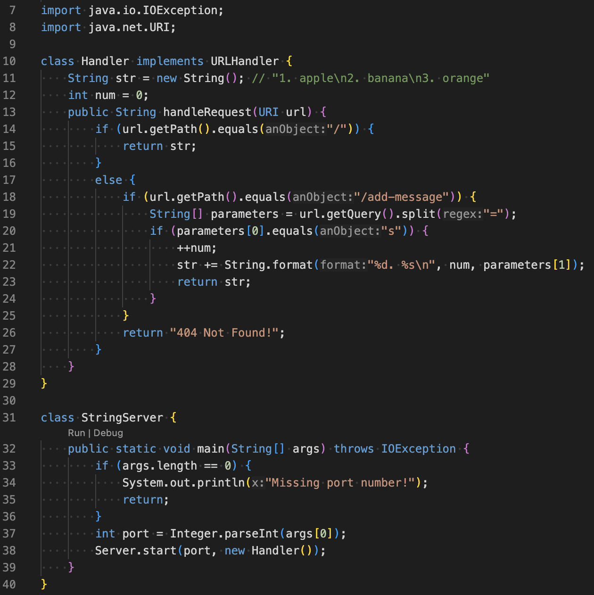
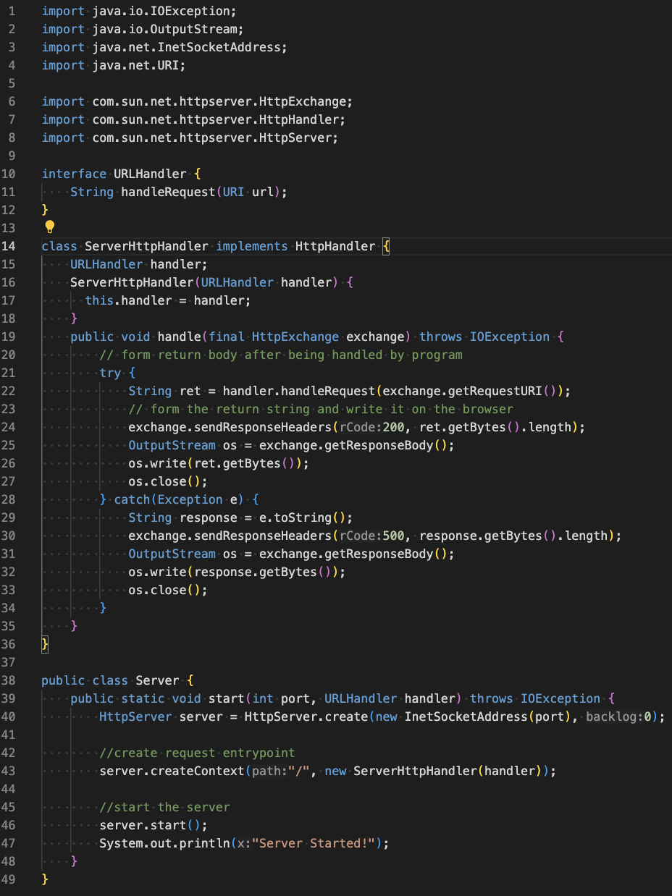
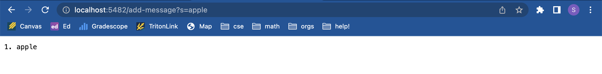
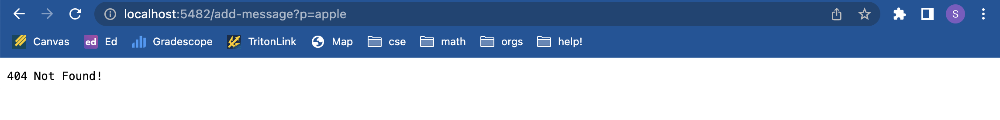
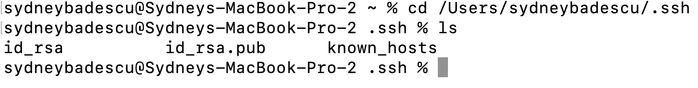
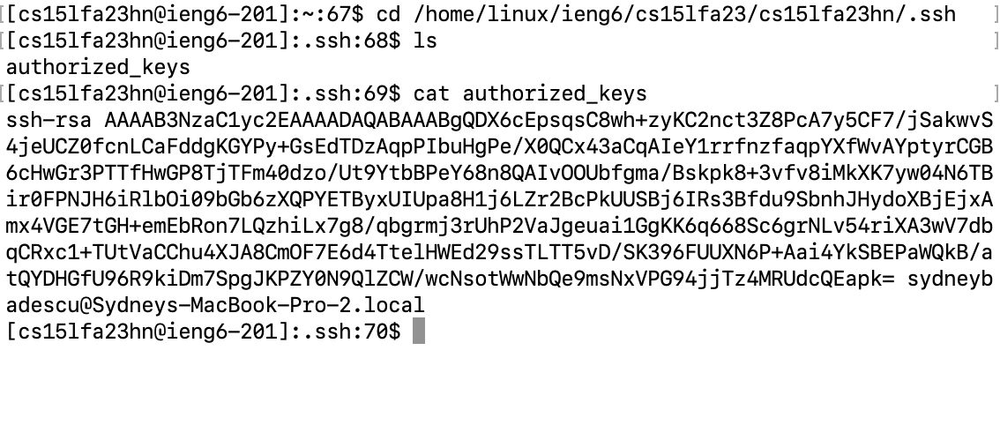
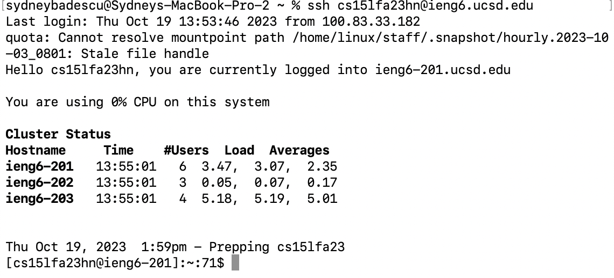

# Lab Report 2
## Part 1 - StringServer

This is the code I wrote for StringServer.java.

And this is the code for Server.java, which is exactly the same as what we saw for NumberServer.java during lab.

After compiling the two files, I start the server in the terminal using the command "java StringServer 5482," with 5482 being my port number. This automatically runs the main method in the class StringServer. From the main method, the Server.start() method is called with the port number 5482 and a new Handler object as the arguments. From Server.start(), many of java's built-in methods are called to start the server, and a new ServerHttpHandler object is created. Java's built-in functionality calls the ServerHttpHandler object's handle(final HttpExchange exchange) method, which calls the handleRequest(URI url) method I wrote in the class Handler in StringServer.java.

_/add-message Demo #1_

When we go to the url "http://localhost:5482/add-message?s=apple", the handleRequest(URI url) method in the Handler class in StringServer.java is called. It is given the URI object "http://localhost:5482/add-message?s=apple" as the argument for the parameter "url". Many built-in methods such as .getPath(), .getQuery(), .equals(), and .split() are called. Initially, str is empty and num is 0, but the handlerequest method increments num to 1 and updates str to be "1. apple\n". 

_/add-message Demo #2_

When we go to the url "http://localhost:5482/add-message?p=apple", the handleRequest(URI url) method in the Handler class in StringServer.java is called. It is given the URI object "http://localhost:5482/add-message?p=apple" as the argument for the parameter "url". Many built-in methods such as .getPath(), .getQuery(), .equals(), and .split() are called. Initially, str is empty and num is 0, and these fields are not changed from their initial values because "p" is in the query before the equals sign instead of "s", so the statement "parameters[0].equals("s")" in the Handler class of StringServer.java evaluates to false.

## Part 2

This is the path to the private ssh key on my personal computer:

This is the path to the public ssh key on the ieng6 computer:

This is me logging into my account on the ieng6 computer without a password. Nice!

## Part 3

During Week 3 lab, I learned that I can run a server from my own personal computer through the terminal. During Week 2, I had been relying on EdStem to connect to the ieng6 computer and start servers. I hadn't realized that I could download the NumberServer.java and Server.java files to my own computer and use the terminal to start a server that other people could connect to! I'm wondering if this is how companies run their websites. Do they have large computers to run a server so that people all over the world can connect to their website?

