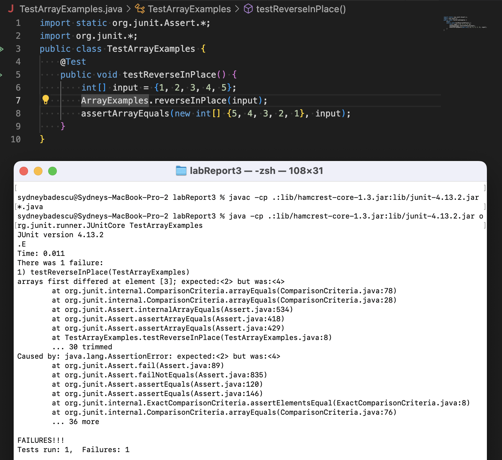
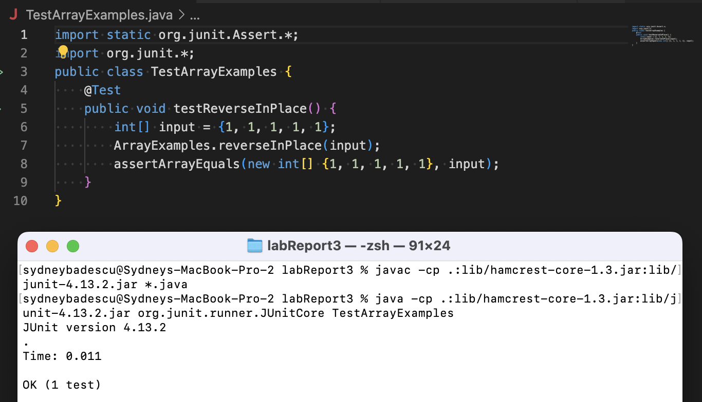

# Part 1: Bugs
I'm choosing to focus on the bug in the `reverseInPlace(int[] arr)` method in ArrayExamples.java.
#### Failure-Inducing Input
An example of a failure-inducing input would be the int array {1, 2, 3, 4, 5}. Below is what this looks like as a JUnit test in a file called TestArrayExamples.java in the same directory as ArrayExamples.java.
```
import static org.junit.Assert.*;
import org.junit.*;
public class TestArrayExamples {
    @Test
    public void testReverseInPlace() {
        int[] input = {1, 2, 3, 4, 5};
        ArrayExamples.reverseInPlace(input);
        assertArrayEquals(new int[] {5, 4, 3, 2, 1}, input);
    }
}
```
#### Non Failure-Inducing Input
An example of an input that does not produce a failure would be the int array {1, 1, 1, 1, 1}. Below is what this looks like as a JUnit test in a file called TestArrayExamples.java in the same directory as ArrayExamples.java.
```
import static org.junit.Assert.*;
import org.junit.*;
public class TestArrayExamples {
    @Test
    public void testReverseInPlace() {
        int[] input = {1, 1, 1, 1, 1};
        ArrayExamples.reverseInPlace(input);
        assertArrayEquals(new int[] {1, 1, 1, 1, 1}, input);
    }
}
```
#### The Symptom
The symptom of the bug is that when tested with the failure-inducing input int array {1, 2, 3, 4, 5}, the actual array produced by reverseInPlace(int[] arr) differs from the expected array at index 3. At index 3, the actual array has int 4 whereas the expected array has int 2. There is no symptom shown when tested with the non failure-inducing input of int array {1, 1, 1, 1, 1} because it passes the test.

This is a screenshot of running the first test, which has failure-inducing input:

This is a screenshot of running the second test, which has a non failure-inducing input:


#### The Bug
BEFORE: The reverseInPlace(int[] arr) with the bug.
```
// In a file called ArrayExamples.java
public class ArrayExamples {
  static void reverseInPlace(int[] arr) {
    for(int i = 0; i < arr.length; i += 1) {
      arr[i] = arr[arr.length - i - 1];
    }
  }
```

AFTER: The reverseInPlace(int[] arr) without the bug.
```
// In a file called ArrayExamples.java
import java.util.Arrays;
public class ArrayExamples {
  static void reverseInPlace(int[] arr) {
    int[] temp = Arrays.copyOf(arr, arr.length);
    for(int i = 0; i < arr.length; i += 1) {
      arr[i] = temp[arr.length - i - 1];
    }
  }
}
```
The original bug was that the reverseInPlace(int[] arr) method would start replacing the elements at the start of the list with those at the back without storing the original elements at the back anywhere, so they were being forgotten. I fixed the issue by storing a copy of the original array in a variable temp so that all elements of the original array were stored safely and would not be forgotten as we changed the elements in the original array.


# Part 2: Researching Commands - Find
NOTES:
- All terminal commands are run with the current working directory as the docsearch repository.
- Before running the following commands in my terminal, I created a .txt file called "sydney.txt". With the docsearch repository as my working directory, the relative path to "sydney.txt" is technical/government/Media/sydney.txt. Similarly, I created "nicole.txt" with relative path technical/plos/nicole.txt from the docsearch directory as well as "baking.txt" with relative path technical/cinnamon/baking.txt.
## Option 1: -cmin n
The -cmin option returns all the paths of files and directories that were changed less than, more than, or exactly n minutes ago. To make it return paths of files and directories changed more than n minutes ago, you put a plus sign "+" before n; for less than, you use a minus sign "-"; and for exactly equal to, you leave n as is.
### Example 1
```
$ find technical -cmin -90
technical
technical/government
technical/government/Media
technical/government/Media/sydney.txt
technical/plos
technical/plos/nicole.txt
technical/cinnamon
technical/cinnamon/baking.txt
```
Since I changed the files sydney.txt, nicole.txt, and baking.txt less than 90 minutes ago, the command "find technical -cmin -90" prints the paths to each of those files as well as the paths of the directories that contain the files. This is useful because it allows us to learn which files were more recently modified, which can help when managing large projects with many contributors who are continuously making changes to the code.

### Example 2
```
$ find technical -cmin 42
technical/cinnamon
technical/cinnamon/baking.txt
```
Since I changed the baking.txt file exactly 42 mintues ago, the command "find technical -cmin 42" prints the file's path as well as the path of the directory containing the .txt file. This is useful because if you have two files with the same name with different paths but you are not sure which is the one that you modified 42 minutes ago (maybe not the most realistic example, but would it would still work), you can use this command to identify the correct file and its path.


## Option 2: -size n[cwbkMG]
The -size option returns the paths of files that are n bytes, kibibytes, mebibytes, gibibytes, etc. in size. In the two examples below, the suffix "c" means bytes, and no suffix means 512-byte blocks by default. Also note that the command rounds up the number of bytes, kibibytes, mebibytes, etc. of each file depending on the suffix used. Adding a "+" or "-" before n has the same effect as in the -cmin option.
### Example 1
```
$ find technical -size 80c
technical/cinnamon/baking.txt
```
Since the baking.txt file contains 80 characters that are each 1 byte, the command "find technical -size 80c" prints its file path. This option is useful becuase it can help us identify which files are exactly a certain size.

### Example 2
```
$ find technical -size +590
technical/government/Gen_Account_Office/Statements_Feb28-1997_volume.txt
```
Since the Statements_Feb28-1997_volume.txt file is over 590 512-byte blocks in size, the command "find technical -size +590" prints its file path. This is useful because it allows us to filter down the many files in the technical directory to the ones over a certain size. Here, since there is only one file over 590 512-byte blocks, we have identified the largest file!


## Option 3: -iname
The -iname option works similar to the -name option except it is not case sensitive. It returns all the file and directory names that match the string entered after -iname regardless of differences in whether they are uppercase or lowercase letters.
### Example 1
```
$ find technical -iname "SYdnEy.txt"
technical/government/Media/sydney.txt
```
Since all the letters in sydney.txt match SYdnEy.txt regardless of case, the command "find technical -iname "SYdnEy.txt"" returns the path to the sydney.txt file. This is useful because it allows us to search for files based on name insensitive to case.

### Example 2
```
$ find technical -iname CiNNAmon
technical/cinnamon
```
Since all the letters in cinnamon match CiNNAmon regardless of case, the command "find technical -iname CiNNAmon" returns the path to the cinnamon directory. This is useful because it allows us to search for directories based on name even if we are not sure of the specific case of each letter.

## Option 4: -newer
The -newer, which takes a file path, returns the paths of all files and directories that were changed after the given file.
### Example 1
```
$ find technical -newer technical/government/Media/sydney.txt
technical
technical/government
technical/government/Media
technical/.DS_Store
technical/plos
technical/plos/nicole.txt
technical/cinnamon
technical/cinnamon/baking.txt
```
Since I created nicole.txt and baking.txt after sydney.txt, the command "find technical -newer technical/government/Media/sydney.txt" prints the paths of those two files, the directories they are contained in, and the directories that sydney.txt is contained in as well. This option is useful because observing changes to files relative to each other can help us construct a timeline of when each file was last modified.

### Example 2
```
$ find technical -newer technical
technical/.DS_Store
```
The command "find technical -newer technical" only prints the file path of the technical folder's .DS_Store file. This is useful because it allows us to observe the behavior of the hidden .DS_Store file and see that it is modified after the folder it corresponds to is modified.


SOURCE: All four of these options were found at [this link.](https://man7.org/linux/man-pages/man1/find.1.html)

