# Lab Report 4 - Vim (Week 7)
Sydney Badescu

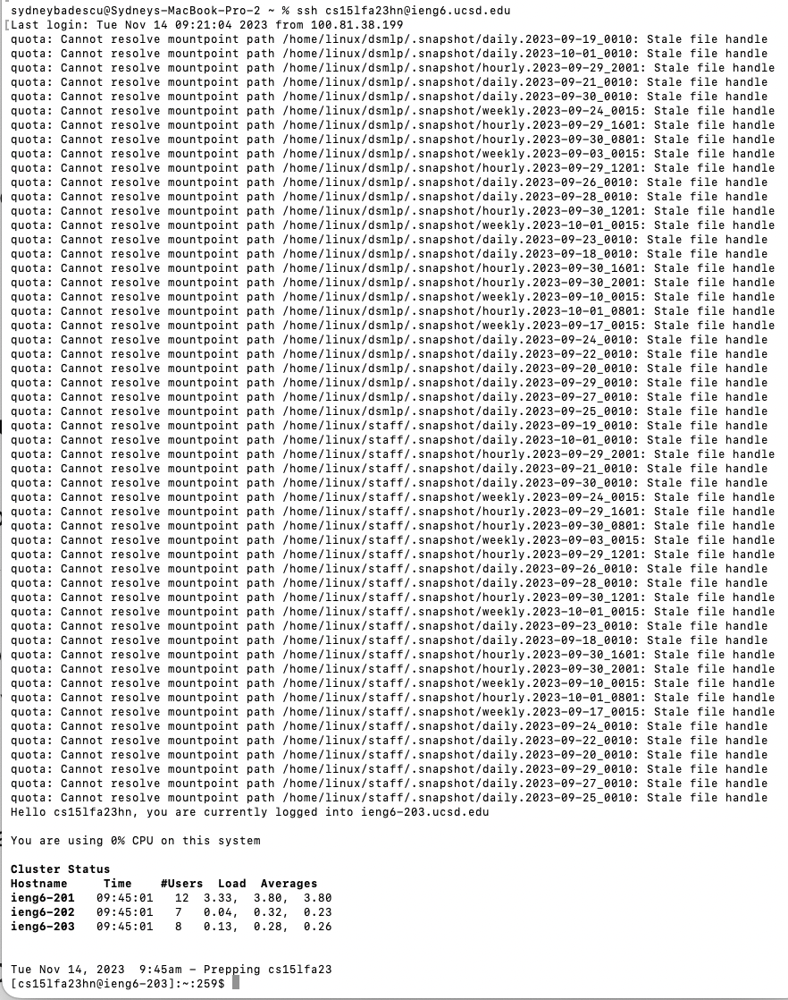

Keys pressed: `s s h <space> c <tab> <enter>`
Pressing <tab> after typing "c" automatically fills in my account name on the ieng6 machines to "cs15lfa23hn@ieng6.ucsd.edu" so that the full command is `"ssh cs15lfa23hn@ieng6.ucsd.edu"`.

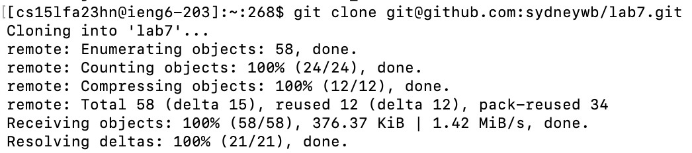

Keys pressed: `g i t <space> c l o n e <space> <Cmd+V> <enter>`
After typing "git clone," I copied the SSH URL of the forked lab7 repository using Cmd+C then pasted it to the command line using Cmd+V.

Keys pressed: `c d <space> l <tab> <enter>`
I use the "cd" command to change my working directory to the root directory of the lab 7 repository. I filled in lab7/ by typing <tab> after "l".

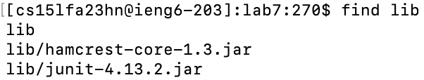

Keys pressed: `f i n d <space> l i b <enter>`
I used the "find" command to recursively print all of the files and directories in the lib folder to standard output. I did this because I need the hamcrest and junit files for the next command where I will write out the classpath to compile the .java files.

Keys pressed: `j a v a c <space> - c p <space> . : <Cmd+V> : <Cmd+V> <space> * . j a v a <enter>`
Before the first <Cmd+V>, I used my trackpad to select "lib/hamcrest-core-1.3.jar" from the previous "find lib" command and pressed <Cmd+C> to copy it to my clipboard and paste it in the command line. Then I did the same procedure for "lib/junit-4.13.2.jar" by copying it with <Cmd+C> and pasting it with <Cmd+V>. Finally I press <enter> to compile the .java files in the lab7 repository.

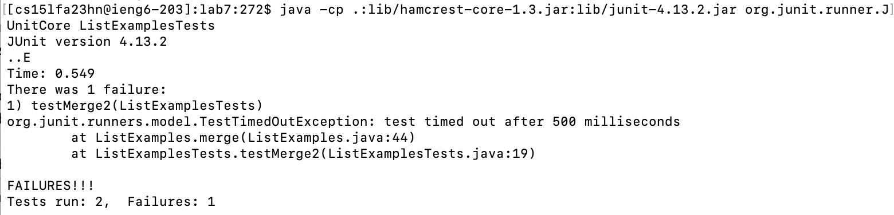

Keys pressed: `<up> <Ctrl+A> <Option+right> <backspace> <Ctrl+E> <backspace> <backspace> <backspace> <backspace> <backspace> <backspace> o r g . j u n i t . r u n n e r . J U n i t C o r e <space> L <tab> T <tab> <backspace> <enter>`
I used keypresses like <Ctrl+A> to navigate to the beginning of the command line and <Option+right> to place the cursor at the end of the first word, which is "javac" so that I could delete one character and make it into "java". Then I did <Ctrl+E> to move the cursor to the end of the command line and replace "*.java" with org.junit.runner.JUnitCore and tab autocomplete "ListExamplesTests".

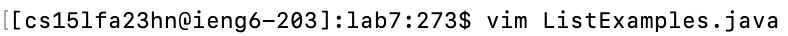

Keys pressed: `v i m <space> L <tab> . <tab> <enter>`
I ran the command "vim ListExamples.java" to open the specified .java file in the vim file editor.

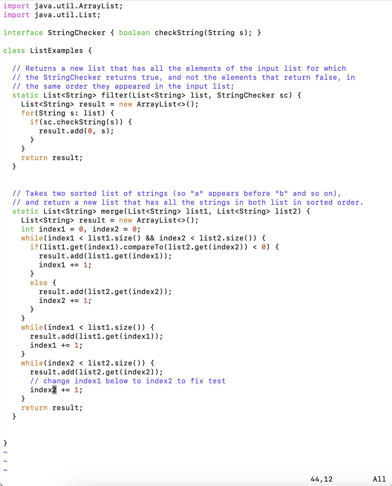

Keys pressed: `3j 4l i <backspace> 2 esc :wq <enter>`
I used the command "3j" in normal mode in vim to move the cursor down 3 lines. Then I used "4l" to move 4 characters to the left. I used "i" to enter insert mode and change "index1" to say "index2". I get back into normal mode by pressing "esc". I save my changes and quit vim by typing :wq.

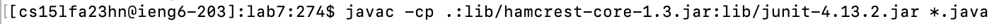

Keys pressed: `<up> <up> <up> <enter>`
I pressed the up arrow 3 times in order to access the "javac -cp .:lib/hamcrest-core-1.3.jar:lib/junit-4.13.2.jar *.java" command which was 3 commands back in my terminal history.

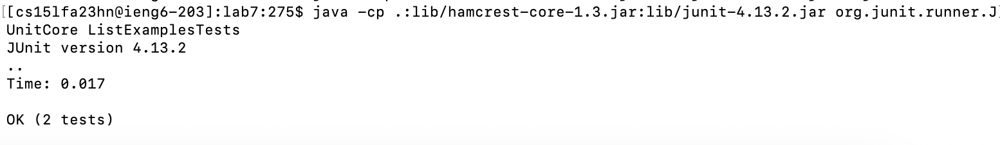

Keys pressed: `<up> <up> <up> <enter>`
I pressed the up arrow 3 times in order to access the "java -cp .:lib/hamcrest-core-1.3.jar:lib/junit-4.13.2.jar org.junit.runner.JUnitCore TestExamplesTests" command which was 3 commands back in my terminal history.

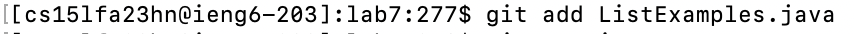

Keys pressed: `g i t <space> a d d <space> L <tab> <enter>`
I tab autocompleted the name of the .java file I edited while doing "git add" to add it to my current commit.

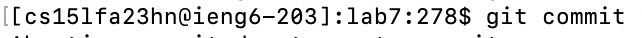

Keys pressed: `g i t <space> c o m m i t <space> - m <space> " c h a n g e d <space> i n d e x 1 <space> t o <space> i n d e x 2 " <enter>`
I used the "git commit" command to commit my file to the cloned repository. I used the "-m" flag to include the commit message in the same line as the "git commit" command.

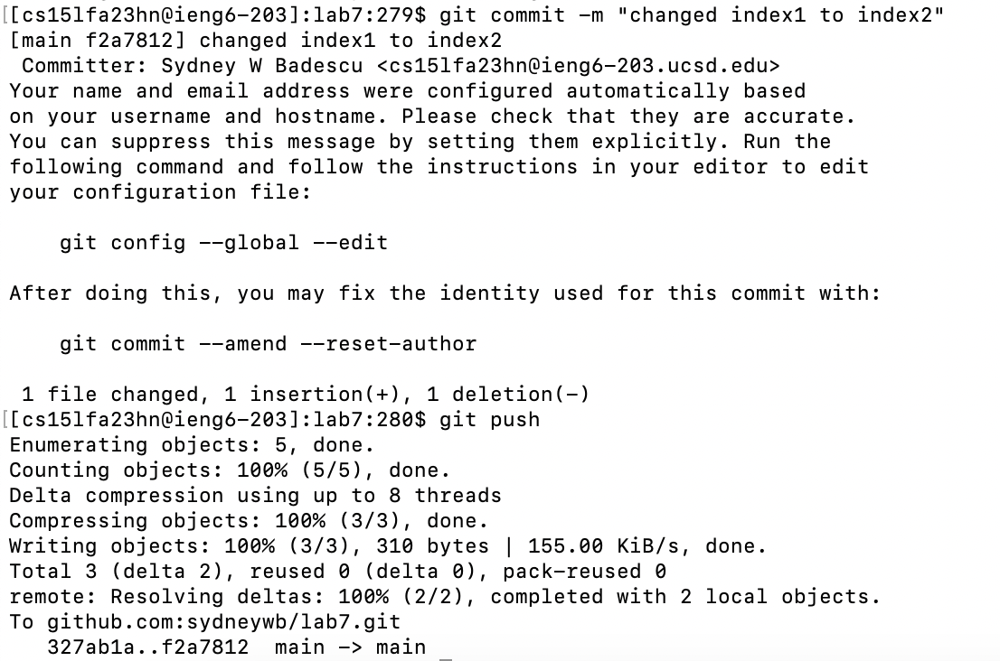

Keys pressed: `g i t <space> p u s h <enter>`
I used the "git push" command to finally push the changes I made in the cloned repository back to GitHub!

