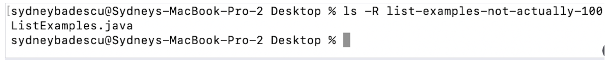

# Lab Report 5
## Part 1 - Debugging Scenario

### Student's Original Post:
Hello! I wrote my implementation of grade.sh from the Week 6 lab and am testing to see if it produces the expected results for different sample student submissions. I wrote a sample student submission that I expect to fail all junit tests in TestListExamples.java, but the output of grade.sh is that the submissions scores 100%! My guess is that line 46 on grade.sh, which reads ```if [[ `grep "OK" junitResult.txt` != "" ]]``` is causing this since that’s the if statement that must evaluate to true to get to the bash command `echo "SCORE AS PERCENT: 100%"` but I’m not sure why it would be evaluating to true when the tests for filter() and merge() should be failing. I think there might be something wrong when I grep “OK” in junitResult.txt, what is different about the contents of junitResult.txt for this submission compared to the other sample student submissions, which all produce the correct output?

This is a screenshot of the symptom:


Below is the code for the filter() method in the student submission and an excerpt of the code from my grade.sh script (including line 46 and the following lines) for reference. Thank you!

This is a screenshot of the filter() method in the student's ListExamples.java in case that helps:


This is a screenshot of the part of grade.sh that I think may be causing the bug:


### TA's Response:
Hi there. Maybe try printing out the result of `grep “OK” junitResult.txt` inside the if then statement that echoes “SCORE AS PERCENT: 100%” (right before or after line 48). Are you redirecting any output to junitResult.txt that might cause `grep “OK” junitResult.txt` to not be empty somewhere in the sample student submission code?

### Student's Response to TA:
OK! I added `echo `grep “OK” junitResult.txt` at line 48 per your suggestion, as shown below.


When running my bash script with the sample student submission again, I got the following output.


Got it! Looks like the bug is that I forgot to delete my debugging statements in the sample student submission that printed to standard output “OK! We made it here.” When I run `java -cp $CPATH org.junit.runner.JUnitCore TestListExamples`, the TestListExamples class calls the student submission in order to test it, which prints “OK! We made it here.” to standard output. This output was then redirected to junitResult.txt on line 43 of grade.sh as shown here.


After that, when we do `grep “OK” junitResult.txt` on line 46 of grade.sh, the output of the command is not empty since it finds the string “OK” from “OK! We made it here.” I had originally intended for the `grep “OK” junitResult.txt` command to only have a non-empty string output when all of the junit tests in TestListExamples pass, since junit outputs something along the lines of “OK (3 tests)” when all the tests pass. Deleting line 15 in the sample student submission `System.out.println(“OK! We made it here.”)` fixes the bug. And produces the correct output of a score of 0%.


### File and Directory Structure Needed:
This shows the structure of the github repository containing the files and directories needed to run the command `bash grade.sh`, which grades the github repository with a student submission given as a command line argument.


This is the structure of the github repository containing the student submission. It only includes one file called ListExamples.java which contains the filter() and merge() methods to be tested. ListExamples.java should not be in nested in any subdirectories so that the grader can find it.


### Contents of Each File Before Fixing the Bug:
Contents of sample student submission (ListExamples.java) before fixing bug:


Also, here’s the contents of the grade.sh file, however it does not contain a bug:


### Fill Command Lines I Ran to Trigger Bug:
Here are the commands I ran in my Mac Terminal to trigger the bug, starting from cloning the repository containing grade.sh to my Desktop:


### A Description of What to Edit to Fix The Bug:
In ListExamples.java of the sample student submission repository, delete line 15 `System.out.println(“OK! We made it here.”)`.


## Part 2 - Reflection

I learned how to use jdb to debug code! I was really excited when we started going through the different commands for the jdb debugger because I was looking forward to using it to debug code for my programming assignments in CSE12. I haven’t gotten the chance to use it yet and I’m not sure if I’ll be able to navigate through the many files and method calls in the PAs but I still think it would be interesting to apply the tools from one class to another. Also, I was super glad to learn about vim because I was very confused when I was first introduced to it in the robotics team I recently joined. Now not only do I use vim in CSE 15L but also to write software for a robot!
